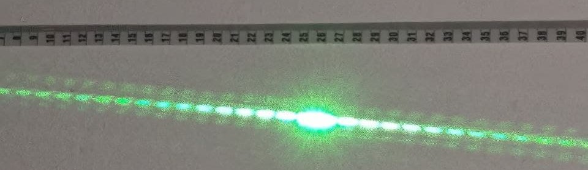
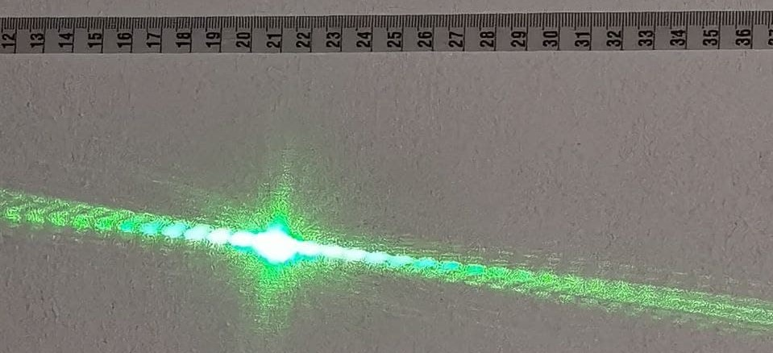
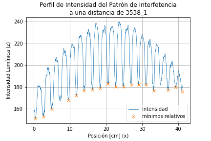

# Práctica de Laboratorio de Física Contemporánea I: Experimento de la Doble Rendija

Aquí se almacenan los datos y el análisis del experimento de la Doble Rendija para el Laboratorio de Física Contemporánea I.

## Equipo: :alien:

:space_invader: José Emiliano Herrera Velázquez

:space_invader: Rodrigo Fernan Sosa González

	 
	
	 

## Materiales

- Cinta métrica

- Flexometro

- Laser verde

- Rendija papel aluminio

- Vernier

## Ensamble del Experimento

## Fotos Tomadas

### Patrón de interferencia laser verde

- Distancia rejilla-pared: 222.8 mm

- Distancia rejilla-pared: 2142 mm

- Distancia rejilla-pared: 2001 mm

- Distancia rejilla-pared: 1844 mm

- Distancia rejilla-pared: 17045 mm

- Distancia rejilla-pared: 1678 mm

- Distancia rejilla-pared: 1594 mm

- Distancia rejilla-pared: 1549 mm

- Distancia rejilla-pared: 1494 mm

- Distancia rejilla-pared: 1383 mm

### Patrón de interferencia laser rojo

- Distancia rejilla-pared: 3538 mm

- Distancia rejilla-pared: 3538 mm

- Distancia rejilla-pared: 3538 mm

- Distancia rejilla-pared: 3538 mm

## Resultados

### Gráficas de perfiles de intensidad y mínimos relativos para laser verde.

### Gráficas de perfiles de intensidad y mínimos relativos para laser rojo.

