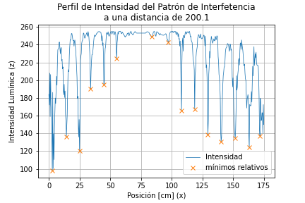

# Práctica de Laboratorio de Física Contemporánea I: Experimento de la Doble Rendija

Aquí se almacenan los datos y el análisis del experimento de la Doble Rendija para el Laboratorio de Física Contemporánea I.

## Equipo: :alien:

:space_invader: José Emiliano Herrera Velázquez

:space_invader: Rodrigo Fernan Sosa González

	 
	
	 

## Fotos Tomadas

## Resultados

### Gráficas

